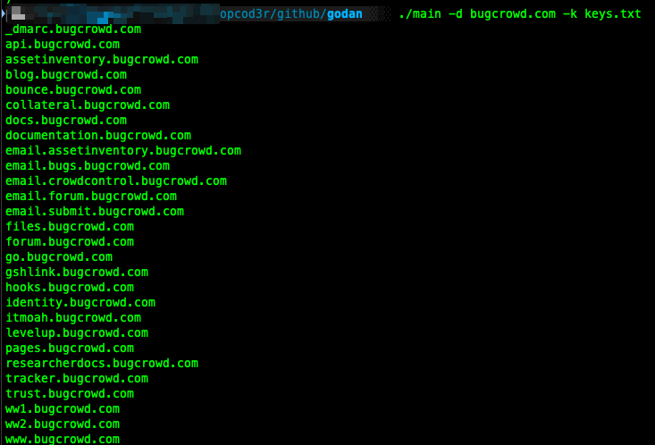

### Godan ( Golang + Shodan ) 

This is a command-line tool that finds subdomains for a given domain using the Shodan API. It supports multiple API keys and handles rate limiting by pausing between requests. The tool also provides detailed output and logging options.

## Features

- Finds subdomains for a given domain using Shodan API
- Supports multiple Shodan API keys
- Handles rate limiting by pausing between requests
- Saves found subdomains to a file
- Provides detailed output and logging with a verbose option
- Loads domains from an input file
- Displays API usage information

## Installation

To use this tool, you need to have [Go](https://golang.org/) installed. Clone the repository and build the project:

```sh
git clone https://github.com/opcod3r/godan.git
cd godan
go mod init github.com/opcod3r/godan
go build -o godan
```

## Usage

```sh
./godan -d <domain> [-f <input_file>] [-k <keys_file>] [-o <output_file>] [-v]
```

### Options

- `-d <domain>`: The target domain to find subdomains for.
- `-f <input_file>`: A file containing a list of domains to find subdomains for (one per line).
- `-k <keys_file>`: A file containing Shodan API keys (one per line). Defaults to `keys.txt`.
- `-o <output_file>`: Save the found subdomains to a file.
- `-v`: Enable verbose output for detailed logging.

### Examples

#### Finding Subdomains for a Single Domain

```sh
./godan -d example.com -k keys.txt
```

#### Finding Subdomains for Multiple Domains from a File

```sh
./godan -f domains.txt -k keys.txt
```

#### Saving Subdomains to a File

```sh
./godan -d example.com -k keys.txt -o subdomains.txt
```

#### Enabling Verbose Output

```sh
./godan -d example.com -k keys.txt -v
```

## Detailed Example

Here is a detailed example of how to use this tool with all the features enabled:

1. Create a file named `keys.txt` and add your Shodan API keys (one per line):

    ```
    key1
    key2
    key3
    ```

2. Create a file named `domains.txt` and add the domains you want to search for (one per line):

    ```
    example.com
    anotherdomain.com
    ```

3. Run the tool:

    ```sh
    ./godan -f domains.txt -k keys.txt -o subdomains.txt -v
    ```

    This command will:
    - Read the domains from `domains.txt`
    - Use the API keys from `keys.txt`
    - Save the found subdomains to `subdomains.txt`
    - Enable verbose output for detailed logging



## License

This project is licensed under the MIT License. See the [LICENSE](LICENSE) file for more details.
